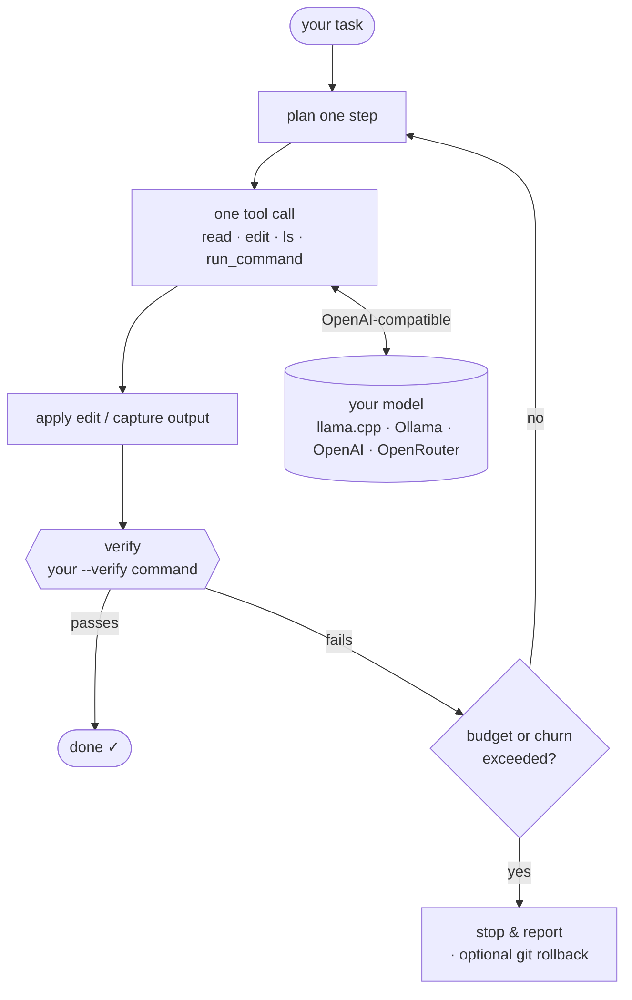

# kloo

Autonomous coding CLI for small **local** LLMs. kloo drives any OpenAI-compatible
endpoint (llama.cpp, Ollama, vLLM, OpenAI, OpenRouter…) to edit and verify code on
its own, in an interactive
[Bubble Tea](https://github.com/charmbracelet/bubbletea) TUI that aims for a
Claude-Code-style feel. (We test against [llama.cpp](https://github.com/ggml-org/llama.cpp)
with Qwen-Coder models.)

Single static Go binary, `CGO_ENABLED=0`, no runtime dependencies.

## How it works

The intelligence lives in the **harness**, not the model: kloo runs the loop and
verifies every step, while the model does one bounded thing per turn.



The `--verify` command is the **only** success signal kloo trusts — not the
model's self-report. See [docs/setup.md](docs/setup.md#the-verify-command-is-the-spec).

## Quick start

**Requires [Go 1.22+](https://go.dev/dl/)** to build or `go install` from source —
make sure it's on your `PATH` (`go version` should print a version). Don't have Go?
Grab a prebuilt binary from [Releases](https://github.com/lokalhub/kloo/releases)
instead — no Go needed.

Install with Go:

```sh
go install github.com/lokalhub/kloo@latest   # → $(go env GOPATH)/bin/kloo
```

Or build from a checkout:

```sh
make binary          # build ./bin/kloo  (needs Go 1.22+ on PATH)
./bin/kloo           # interactive TUI session
./bin/kloo "say hi"  # one-shot, streamed to stdout
```

kloo talks to an OpenAI-compatible endpoint (default
`http://127.0.0.1:8080/v1`, model `local` — a placeholder a single-model llama.cpp
server ignores). Point it at your own with
`--endpoint` / `--model` or the `KLOO_*` env vars. For a **hosted** provider
(OpenRouter, OpenAI, …) also set a bearer token:

```sh
export KLOO_API_KEY="$OPENROUTER_API_KEY"   # falls back to OPENAI_API_KEY
kloo --effort heavy --endpoint https://openrouter.ai/api/v1 \
     --model deepseek/deepseek-v4-flash \
     --verify 'npm run build && bash benchmark/assert.sh src'
```

See **[docs/setup.md](docs/setup.md)** for prerequisites (endpoint, git, the
verify command) and the local/hosted recipes.

## Usage

| Invocation | What it does |
|---|---|
| `kloo` | Launch the interactive TUI session (autonomous loop under the UI). |
| `kloo "<task>"` | One-shot: stream a single completion to stdout (scripting). |
| `kloo --headless --verify '<cmd>' "<task>"` | Run the autonomous loop non-interactively, streaming progress to stdout. |

### Common flags

| Flag | Default | Meaning |
|---|---|---|
| `--effort` | `medium` | Effort tier (`fast`\|`medium`\|`heavy`) — seeds step/token budgets + churn patience. |
| `--model` | `local` | Model your endpoint serves (placeholder `local` for single-model llama.cpp). |
| `--endpoint` | `http://127.0.0.1:8080/v1` | OpenAI-compatible base URL. |
| `--mode` | `auto` | Run mode (`auto`\|`manual`). |
| `--max-steps` | `40` | Max autonomous steps. |
| `--temperature` | `0.1` | Sampling temperature. |
| `--verify` | `go test ./...` | Verify command the loop runs each step (the real success signal). |
| `--headless` | `false` | Run the loop non-interactively (requires a task arg). |
| `--profile` | _(unset)_ | Path to `profiles.json` (default `~/.config/kloo/profiles.json`). |

Config precedence is **flags > env (`KLOO_*`) > profile file > defaults**.
Env vars include `KLOO_ENDPOINT`, `KLOO_MODEL`, `KLOO_EFFORT`, and
`KLOO_API_KEY` (bearer token for hosted endpoints; falls back to
`OPENAI_API_KEY`); `NO_COLOR` disables all TUI colour (see below).

Effort tiers seed the loop budgets in one switch (the model is independent):
`fast` (20 steps/80k tok), `medium` (40/200k — the default), `heavy` (80/500k).
The **full reference** — every flag, env var, the effort table, and the
`profiles.json` schema — is in **[docs/configuration.md](docs/configuration.md)**.

## Interactive TUI

The TUI shows a live header (model · effort · running token total · step ·
mode), an animated thinking line, and a transcript of colour-coded tool cards,
diffs, command output, and assistant prose. Slash commands while running:
`/add`, `/model`, `/mode`, `/stop`, `/diff`; `Esc`/`Ctrl-C` interrupts;
`Ctrl-O` expands truncated command output.

See **[docs/tui.md](docs/tui.md)** for the full TUI experience — the live token
counter, the semantic colour theme and `NO_COLOR` degrade, and the transcript
card/diff/output/markdown surfaces.

## Development

```sh
make check    # build + vet + gofmt check + test (mirrors CI)
make test
make run ARGS='"say hi"'
```

All automated gates are zero-lag: `go build ./...`, `go test ./...`,
`go vet ./...`, and `gofmt -l .` must be clean. Code lives under `internal/**`;
`main.go` is a thin entrypoint.
