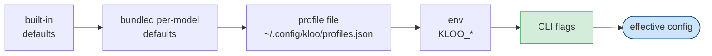

# kloo configuration reference

Every knob kloo reads, where it comes from, and what it does. Source of truth:
`internal/config/config.go` and `internal/config/effort.go`.

## Precedence

```
flags  >  env (KLOO_*)  >  profile file  >  bundled per-model defaults  >  built-in defaults
```



Each layer overrides the one before it — the rightmost source that sets a field wins.

The **bundled per-model defaults** layer fills gaps for known coding models (see
[Bundled per-model defaults](#bundled-per-model-defaults)) so they work without a
hand-written profile. It sits **below** your profile, so the profile, env, and
flags **always** override it; an unmatched model just keeps the built-in defaults.

The **effort tier** is resolved first and seeds the loop budgets (steps/tokens/
churn/wall-clock). The **model is a separate axis** — flags/env/profile set it
independently of the tier. An unset effort is `medium` (generous budgets, with
churn detection as the primary guard).

## Flags

| Flag | Default | Meaning |
|---|---|---|
| `--effort` | `medium` | Effort tier (`fast`\|`medium`\|`heavy`) — seeds step/token budgets + churn patience (see table below). |
| `--model` | `local` | Model your endpoint serves. `local` is a neutral placeholder — a single-model llama.cpp server ignores it; set a real name for Ollama/OpenAI/OpenRouter. With `--provider`, this is a **model alias** looked up in that provider's `models` map (see [providers](#providers--endpointkey--model-aliases)). |
| `--provider` | _(unset)_ | Named provider from the profile's `providers` block. Selecting one sets the endpoint + bearer key and scopes the `--model` alias lookup, so the same model on different providers is just one alias per provider. |
| `--endpoint` | `http://127.0.0.1:8080/v1` | OpenAI-compatible base URL. Set directly, or via `--provider` (a provider's `endpoint` wins over this default but loses to an explicit `--endpoint`/`KLOO_ENDPOINT`). |
| `--mode` | `auto` | Run mode (`auto`\|`manual`). |
| `--max-steps` | `500` | Max autonomous steps. Also seeded by `--effort` (fast 50 · medium 500 · heavy 1000); an explicit `--max-steps` overrides the tier. |
| `--ctx` | `8000` | Per-step context window (`maxContextTokens`). Set it to match your server's `-c`/`num_ctx`. **Needed for a llama-swap/Ollama alias** (`snappy`, `smart`) — the bundled per-model defaults key on real model ids, so an alias falls to the conservative 8000 and kloo over-compacts on a larger server. Overrides profile/bundled/built-in. |
| `--temperature` | `0.1` | Sampling temperature. |
| `--verify` | _(auto-detected)_ | Override the verify command run each step — **the real success signal**. When unset, kloo auto-detects the project's build/test (`package.json`→`npm run build`/`npm test`, `go.mod`→`go test ./...`, `Cargo.toml`→`cargo build`, `pyproject.toml`→`python -m pytest`). If nothing is recognised the run is **unverified** — `finish` stops it calmly, but no run is marked success. See [setup.md](setup.md#the-verify-command-is-the-spec). |
| `--headless` | `false` | Run the loop non-interactively (requires a task arg). |
| `--no-mcp` | `false` | Disable all [MCP servers](mcp.md) for this run (overrides `KLOO_MCP` and the profile's `mcpServers`). |
| `--allowed-dirs` | _(unset)_ | Directories **outside** the workspace that an `AGENTS.md` [`@import`](#project-instructions-agentsmd) may read from. Repeatable or comma-separated. Read-only and load-time only — it never widens the model's file tools. |
| `--allow-env` | _(unset)_ | Env var **names** to forward from kloo's own environment into `run_command` (repeatable/comma-separated). By default executed commands get a least-privilege env (`PATH/HOME/LANG/…`) so a model-proposed command can't exfiltrate secrets; this is the deliberate, user-granted passthrough for a **trusted deploy/CI step** that needs a specific secret (e.g. `--allow-env CLOUDFLARE_API_TOKEN,ADMIN_PASSWORD`). The value is read from kloo's env at run time — it never appears in the model's prompt or transcript. |
| `--profile` | _(unset)_ | Path to `profiles.json`; defaults to `~/.config/kloo/profiles.json`. |

## Environment variables

| Var | Effect |
|---|---|
| `KLOO_ENDPOINT` | OpenAI-compatible base URL (same as `--endpoint`). |
| `KLOO_MODEL` | Model name / alias (same as `--model`). |
| `KLOO_PROVIDER` | Named provider from the profile's `providers` block (same as `--provider`). |
| `KLOO_CONTEXT_TOKENS` | Per-step context window (same as `--ctx`). |
| `KLOO_EFFORT` | Effort tier (same as `--effort`). |
| `KLOO_API_KEY` | Bearer token for the endpoint. Required for hosted providers (OpenRouter, OpenAI, …); not needed for a local llama.cpp / Ollama server, which has no auth. |
| `OPENAI_API_KEY` | Fallback bearer token used only when `KLOO_API_KEY` is unset. |
| `KLOO_MCP` | Set to `0` / `false` to disable all [MCP servers](mcp.md). `--no-mcp` overrides it; both override the profile. |
| `XDG_CONFIG_HOME` | If set, the profile file lives at `$XDG_CONFIG_HOME/kloo/profiles.json`. |
| `NO_COLOR` | Disables all TUI colour (see [tui.md](tui.md)). |

## Effort tiers

Selecting a tier seeds the loop budgets in one switch. **Churn detection (no
progress) is the primary "stop when stuck" signal**; the other budgets are loose
backstops — **tokens are unbounded** and steps/wall-clock are generous so a slow
local model isn't cut off mid-progress. A tier does **not** set the model — that's
a separate axis (`--model` / `KLOO_MODEL` / profile). Any field is overridable per
tier via the `efforts` section of the profile file.

| Tier | Max steps | Churn rounds | Max tokens | Wall-clock |
|---|---|---|---|---|
| `fast` | 50 | 2 | 0 (unbounded) | 900 s |
| `medium` _(default)_ | 500 | 3 | 0 (unbounded) | 3600 s |
| `heavy` | 1000 | 10 | 0 (unbounded) | 7200 s |

- **fast** — quick & decisive; low churn patience, bail early if stuck.
- **medium** — the balanced default; generous budgets.
- **heavy** — patient & thorough; for hard multi-file work.

Tokens default to **unbounded** because cost is the endpoint/service's domain (like
other CLI agents) and the working-memory feature is built to let small models run
long, many-step tasks — a token cap would cut those short. Set `maxTokens` in the
profile if you want a hard kloo-side cost cap.

## Budgets and context

| Knob | Default | Meaning |
|---|---|---|
| `maxContextTokens` | `8000` | Per-step context **window** (the hard ceiling for the whole assembled prompt). Also the working-memory compaction trigger — see below. Conservative for small local models. |
| `maxTokens` | `0` (unbounded) | Cumulative prompt+completion tokens per run. `0` ⇒ unbounded — the default; cost is the service's domain, churn/steps/wall-clock guard runaways. |
| `maxWallClockSeconds` | `3600` | Wall-clock ceiling per run — the final net for a churn-evading loop. `0` ⇒ unbounded. |
| `churnRounds` | `3` | Repeated-failure / repeated-edit rounds before the loop halts and reports. |

`maxTokens`, `maxWallClockSeconds`, and `churnRounds` are seeded by the effort tier;
`maxContextTokens` is a flat default. All are overridable per-model in the profile.

### `maxContextTokens` and working memory

As of the working-memory feature (P00), `maxContextTokens` governs **whole-prompt
compaction**, not just the repo map. Each turn kloo assembles a pin-hot set (the
task, the last verify result, the file under edit re-read fresh from disk, and the
recent turns) plus a running summary, and keeps the **entire** prompt under
`maxContextTokens`:

- When the projected prompt crosses **~70%** of the window, kloo folds the cold
  middle of the transcript into a deterministic running summary (keeping applied
  diffs and verify outcomes verbatim; stubbing raw file dumps — files are re-read
  from disk on demand). No model call is involved.
- The window is a **hard ceiling**: the repo map is capped at a fraction of it
  (so it can no longer consume the whole window), and content is shed in a fixed
  order to stay under it. The goal (the task) is never dropped.
- Set `maxContextTokens` to your model's real context size (e.g. match
  llama.cpp's `--ctx-size`). A larger window means later/less compaction; a small
  one means aggressive, early compaction — the manager manufactures a bigger
  effective window for small local models.

A headless run prints `compactions: N` in its report only when memory compacted
(`N > 0`); the TUI status line shows a `⟲N` indicator while it happens.

## Project instructions (`AGENTS.md`)

If your repo has an **`AGENTS.md`** (the open agent-instructions convention), kloo
loads it into the **system prompt** and applies it **every turn**. Unlike a file you
`read_file`, the system prompt is never compacted — so `AGENTS.md` content is
*pinned*: the model can't "forget" it on a long run. kloo looks in the **launch
directory and each immediate subdirectory** (skipping `node_modules`, `dist`,
`build`, `www`, … and dot-dirs), so a project that lives in `./myApp` still has its
rules applied. All discovered files are stacked and labelled with their path.

### `@import` — pull in other files

An `AGENTS.md` can pull another file's content in, pinned the same way, with an
import directive on its own line:

```md
# AGENTS.md
Follow the shared conventions:
@import lokal/agents/common/conventions/ui.md
@import lokal/agents/common/conventions/api.md
```

- **Syntax.** `@import <path>` (the rest of the line is the path), or a bare
  `@<path>` when the path is a single token and looks like a path (contains `/` or
  `.`). A bare non-path-like word on its own line (e.g. `@channel`) is left as prose.
- **Paths with spaces.** Use the explicit form, or quote the path:
  `@import "my docs/ui rules.md"`, `@import 'my docs/ui rules.md'`, or bare
  `@"my docs/ui rules.md"`.
- **Resolution.** Relative to the importing `AGENTS.md`'s own directory (or an
  absolute path). The content is expanded **in place**, labelled `### imported: <path>`.
- **Not recursive.** An imported file's own `@lines` stay literal — this sidesteps
  cycles. (Import the files you need directly from `AGENTS.md`.)
- **Jailed by default.** A path is read only if it resolves **inside the workspace**;
  one that escapes is skipped with a log line — unless its directory is whitelisted
  with `--allowed-dirs` (below).
- A missing/empty/oversize import is skipped (logged), never fatal. Each import is
  read up to 256 KiB; the total instructions budget still applies (below).

### `--allowed-dirs` — import from outside the workspace

When the file you want to import lives **outside** the workspace (e.g. a shared
convention library beside the project, not under it), whitelist its directory:

```bash
# launched inside the project; conventions are a sibling tree
kloo --allowed-dirs ../../../lokal/agents/common/conventions
```

with, in the project's `AGENTS.md`:

```md
@import ../../../lokal/agents/common/conventions/ui.md
```

- **Syntax.** Repeatable or comma-separated:
  `--allowed-dirs a,b` or `--allowed-dirs a --allowed-dirs b`. Each entry is a
  **directory** (any import resolving inside it, or a subdir, is permitted).
- Relative paths resolve against the launch cwd; absolute paths work too; symlinks
  are resolved before the containment check.
- A directory whose path contains a comma must use the **repeated-flag** form (the
  comma form splits on `,`); a path with spaces needs shell quoting.
- This is **read-only and load-time only**: it widens `@import` resolution, never
  the model's `read_file`/`edit_file`/`run_command`, which stay jailed to the
  workspace.

> Tip: if you launch kloo at a parent that already contains the shared tree (e.g. a
> monorepo root), the conventions are *inside* the workspace and you don't need
> `--allowed-dirs` at all — just `@import path/under/the/workspace.md`.

### Instructions budget

The pinned `AGENTS.md` block (including any `@import`-ed content) is re-sent on
**every** turn and never compacted, so it's deliberately bounded: **~3% of the
context window** (`maxContextTokens`), clamped to a **16 KiB floor** (so small
models keep a usable minimum) and a **64 KiB ceiling** (so a huge window can't pin a
giant rulebook every turn). Past the budget, the instructions are truncated with a
`…[truncated]` marker. On an 8k window that's the 16 KiB floor; on a 256k+ window
it's the 64 KiB ceiling.

## Bundled per-model defaults

kloo ships an **in-binary table of known-good defaults** for common coding models,
so a recognised model "just works" without a hand-written profile. Matching is by
**model-id substring**, case-insensitive, evaluated in declared order — **first
match wins** (so a specific key like `deepseek-coder` is tested before the
`deepseek` family key). A match seeds `toolFormat`, `temperature`, and
`maxContextTokens`.

This layer sits **below your profile** in the precedence chain (`flags > env >
profile > bundled defaults > built-in defaults`): the bundled values overwrite
only the flat built-in defaults, and **anything you set in your profile, env, or a
flag still wins**. A model that matches **no** row keeps the built-in defaults —
unchanged.

| Model (matched substring) | `toolFormat` | `temperature` | `maxContextTokens` |
|---|---|---|---|
| Qwen2.5-Coder (`qwen2.5-coder`, 7B/14B/32B) | `native` | `0.1` | `24576` |
| Qwen3-Coder-30B-A3B (`qwen3-coder`) | `native` | `0.1` | `32768` |
| Devstral-Small-2-24B (`devstral`) | `native` | `0.15` | `32768` |
| DeepSeek-Coder (`deepseek-coder`) | `native` | `0.1` | `16384` |
| DeepSeek v3 / chat (`deepseek`) | `native` | `0.1` | `32768` |
| _any unmatched model_ (generic fallback) | `native` | `0.1` | `8000` |

The generic fallback is pinned **equal to the built-in defaults**, so an unmatched
model is byte-for-byte unchanged.

> **`maxContextTokens` here is the curator's per-step budget, not the model's raw
> window.** The seeded values reflect each model's real context size *ordinally*
> (a bigger window gets a bigger budget) while staying **bounded** — pouring a
> model's full 128K/256K window into the per-step curator would blow memory. Set
> `maxContextTokens` in your profile to your model's real window if you want a
> larger (or smaller) per-step budget.

The table is the source of truth in `internal/config/model_defaults.go`.

## Profile file

Optional. Default location `~/.config/kloo/profiles.json` (or
`$XDG_CONFIG_HOME/kloo/profiles.json`). A **missing** file is not an error —
defaults apply. A malformed file is an error.

Two sections, both optional:

- **Per-model entries** (keyed by model name) — overrides applied when that model
  is the resolved model.
- **`efforts`** — per-tier budget overrides applied to the built-in tier before the
  env/flag layers.

```jsonc
{
  // per-model overrides (key = model name as passed to --model / KLOO_MODEL)
  "qwen2.5-coder": {
    "toolFormat": "native",        // "" (auto) | "auto" | "native" | "trained" | "xml"
    "temperature": 0.2,
    "fewShotPath": "/path/to/fewshot.txt",  // optional gold examples for the system prompt
    "maxContextTokens": 8000,
    "maxTokens": 200000,
    "maxWallClockSeconds": 600,
    "churnRounds": 3
  },
  "deepseek/deepseek-v4-flash": {
    "toolFormat": "native",
    "temperature": 0.1
  },

  // per-tier budget overrides (adjust a built-in effort tier)
  "efforts": {
    "heavy": {
      "maxSteps": 120,
      "churnRounds": 15,
      "maxTokens": 800000,
      "maxWallClockSeconds": 3600
    }
  }
}
```

Per-model fields: `toolFormat`, `temperature`, `fewShotPath`, `maxContextTokens`,
`maxTokens`, `maxWallClockSeconds`, `churnRounds`.
Per-tier (`efforts`) fields: `maxSteps`, `churnRounds`, `maxTokens`,
`maxWallClockSeconds` (budgets only — no model).

**`toolFormat` accepted values:** `""` (unset → auto-select) · `"auto"` (an
explicit alias for unset/auto-select — **safe, never crashes a run**) · `"native"`
(native function-calling) · `"trained"` (the model's trained tool-call format, via
the native path) · `"xml"` (XML fallback, forced even on a tool-capable endpoint).
With `""`/`"auto"`, kloo picks native FC when the endpoint advertises tools, else
XML. Any other value (e.g. `"yaml"`) is rejected.

### `providers` — endpoint+key + model aliases

A reserved top-level key, **`providers`**, decouples *where you send a request*
(endpoint + bearer key) from *which model* you ask for. The same model is served
by many providers (OpenRouter, Together, Fireworks, the direct vendor API…), so
keying config by model name alone can't tell them apart — `providers` fixes that.

Each entry is a provider you name (e.g. `or` for OpenRouter), holding an
`endpoint`, an `apiKey`, and that provider's own `models` map of **aliases**. You
select one with `--provider <name>` / `KLOO_PROVIDER`, and `--model <alias>` then
resolves to that provider's real model id plus its tuning:

```jsonc
{
  "providers": {
    "or": {
      "endpoint": "https://openrouter.ai/api/v1",
      "apiKey": "${OPENROUTER_API_KEY}",   // ${VAR}/~ expanded — never inline the raw secret
      "models": {
        "dsv4": {                          // alias → real id + per-model tuning
          "model": "deepseek/deepseek-v4-flash",
          "toolFormat": "native",
          "temperature": 0.1,
          "maxContextTokens": 128000
        }
      }
    },
    "together": {
      "endpoint": "https://api.together.xyz/v1",
      "apiKey": "${TOGETHER_API_KEY}",
      "models": { "dsv4": { "model": "deepseek-ai/DeepSeek-V4-Flash" } }
    }
  }
}
```

```sh
kloo --provider or       --model dsv4   # → OpenRouter, deepseek/deepseek-v4-flash
kloo --provider together --model dsv4   # → Together,  deepseek-ai/DeepSeek-V4-Flash
```

The same alias (`dsv4`) maps to each provider's own slug, so switching providers
is one token. Notes:

- **Precedence is unchanged:** a provider sets endpoint/key at the *profile*
  layer, so `KLOO_ENDPOINT`/`KLOO_API_KEY` and `--endpoint` still override it
  (`flags > env > profile > defaults`). `KLOO_API_KEY` overrides a provider's key;
  the `OPENAI_API_KEY` fallback only applies when nothing else set a key.
- **`apiKey` is `expandValue`'d** (`${ENV_VAR}` / leading `~`), exactly like
  `mcpServers` headers — keep real secrets out of the committed file.
- **A `--model` with no matching alias is used verbatim** as the model id, so
  `--provider or --model gpt-4o` works without an alias entry.
- **An unknown `--provider` is a hard error** (not a silent fallback).
- Per-model fields inside an alias are the same set as the legacy top-level
  entries: `toolFormat`, `temperature`, `fewShotPath`, `maxContextTokens`,
  `maxTokens`, `maxWallClockSeconds`, `churnRounds`.

Legacy top-level model-keyed entries still work unchanged when no `--provider` is
given — `providers` is purely additive.

### `mcpServers` — external MCP tool servers

A third optional, reserved top-level key, **`mcpServers`**, declares external
[MCP](mcp.md) servers whose tools kloo consumes as builtins. Each entry is either a
stdio server (`command` + optional `args`/`env`) or an HTTP server (`url` +
optional HTTP-only `headers`), with an `exposeMode` (`curated`\|`lazy`\|`all`)
controlling how many of its tools enter the model's window. An optional sibling
`mcp` object holds the global cap (`maxExposedTools`, default 16).

```jsonc
{
  "mcpServers": {
    "mempalace": { "command": "mempalace-mcp", "args": ["--db", "~/.mempalace"],
                   "exposeMode": "curated", "expose": ["recall", "remember"] },
    "docs":      { "url": "https://mcp.example.com/mcp",
                   "headers": { "Authorization": "Bearer ${MCP_TOKEN}" },
                   "exposeMode": "lazy" }
  },
  "mcp": { "maxExposedTools": 16 }
}
```

`mcpServers` follows the same precedence as everything else (it's a profile-layer
block); the global on/off switch is `--no-mcp` / `KLOO_MCP` above it. Because kloo
**launches** the `command`/`args`/`env` you put here, MCP tools run outside the
workspace sandbox and your profile file is a trust root. Header values receive the
same `~` / `$VAR` expansion as stdio values, so prefer `${MCP_TOKEN}`-style
references instead of inline secrets; kloo never logs header values. The **full
reference, including the security model, curated-vs-lazy guidance, static header
auth details, and troubleshooting, is in [mcp.md](mcp.md)**.

See **[setup.md](setup.md)** for prerequisites and the local/hosted endpoint
recipes.
