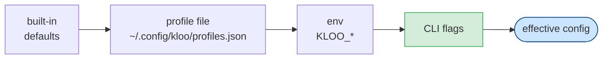

# kloo configuration reference

Every knob kloo reads, where it comes from, and what it does. Source of truth:
`internal/config/config.go` and `internal/config/effort.go`.

## Precedence

```
flags  >  env (KLOO_*)  >  profile file  >  built-in defaults
```



Each layer overrides the one before it — the rightmost source that sets a field wins.

The **effort tier** is resolved first and seeds the loop budgets (steps/tokens/
churn/wall-clock). The **model is a separate axis** — flags/env/profile set it
independently of the tier. An unset effort is `medium`, which equals kloo's
historical flat defaults, so it changes nothing for an existing setup.

## Flags

| Flag | Default | Meaning |
|---|---|---|
| `--effort` | `medium` | Effort tier (`fast`\|`medium`\|`heavy`) — seeds step/token budgets + churn patience (see table below). |
| `--model` | `local` | Model your endpoint serves. `local` is a neutral placeholder — a single-model llama.cpp server ignores it; set a real name for Ollama/OpenAI/OpenRouter. |
| `--endpoint` | `http://127.0.0.1:8080/v1` | OpenAI-compatible base URL. |
| `--mode` | `auto` | Run mode (`auto`\|`manual`). |
| `--max-steps` | `40` | Max autonomous steps. |
| `--temperature` | `0.1` | Sampling temperature. |
| `--verify` | `go test ./...` | Verify command run each step — **the real success signal** (see [setup.md](setup.md#the-verify-command-is-the-spec)). |
| `--headless` | `false` | Run the loop non-interactively (requires a task arg). |
| `--profile` | _(unset)_ | Path to `profiles.json`; defaults to `~/.config/kloo/profiles.json`. |

## Environment variables

| Var | Effect |
|---|---|
| `KLOO_ENDPOINT` | OpenAI-compatible base URL (same as `--endpoint`). |
| `KLOO_MODEL` | Model name (same as `--model`). |
| `KLOO_EFFORT` | Effort tier (same as `--effort`). |
| `KLOO_API_KEY` | Bearer token for the endpoint. Required for hosted providers (OpenRouter, OpenAI, …); not needed for a local llama.cpp / Ollama server, which has no auth. |
| `OPENAI_API_KEY` | Fallback bearer token used only when `KLOO_API_KEY` is unset. |
| `XDG_CONFIG_HOME` | If set, the profile file lives at `$XDG_CONFIG_HOME/kloo/profiles.json`. |
| `NO_COLOR` | Disables all TUI colour (see [tui.md](tui.md)). |

## Effort tiers

Selecting a tier seeds the loop budgets in one switch. A tier does **not** set the
model — that's a separate axis (`--model` / `KLOO_MODEL` / profile), so the same
tier means the same intensity on a local 8B or a frontier model. Any field is
overridable per tier via the `efforts` section of the profile file.

| Tier | Max steps | Churn rounds | Max tokens | Wall-clock |
|---|---|---|---|---|
| `fast` | 20 | 2 | 80 000 | 300 s |
| `medium` _(default)_ | 40 | 3 | 200 000 | 600 s |
| `heavy` | 80 | 10 | 500 000 | 1800 s |

- **fast** — quick & decisive; bail early if stuck.
- **medium** — the balanced default (equals the legacy flat defaults).
- **heavy** — patient & thorough; for hard multi-file work.

## Budgets and context

| Knob | Default | Meaning |
|---|---|---|
| `maxContextTokens` | `8000` | Per-step context window the repo-map curator must stay under. Conservative for small local models. |
| `maxTokens` | `200000` | Cumulative prompt+completion tokens per run. `0` ⇒ unbounded. |
| `maxWallClockSeconds` | `600` | Wall-clock ceiling per run. `0` ⇒ unbounded. |
| `churnRounds` | `3` | Repeated-failure / repeated-edit rounds before the loop halts and reports. |

`maxTokens`, `maxWallClockSeconds`, and `churnRounds` are seeded by the effort tier;
`maxContextTokens` is a flat default. All are overridable per-model in the profile.

## Profile file

Optional. Default location `~/.config/kloo/profiles.json` (or
`$XDG_CONFIG_HOME/kloo/profiles.json`). A **missing** file is not an error —
defaults apply. A malformed file is an error.

Two sections, both optional:

- **Per-model entries** (keyed by model name) — overrides applied when that model
  is the resolved model.
- **`efforts`** — per-tier budget overrides applied to the built-in tier before the
  env/flag layers.

```jsonc
{
  // per-model overrides (key = model name as passed to --model / KLOO_MODEL)
  "qwen2.5-coder": {
    "toolFormat": "native",        // native | xml  (tool-call adapter)
    "temperature": 0.2,
    "fewShotPath": "/path/to/fewshot.txt",  // optional gold examples for the system prompt
    "maxContextTokens": 8000,
    "maxTokens": 200000,
    "maxWallClockSeconds": 600,
    "churnRounds": 3
  },
  "deepseek/deepseek-v4-flash": {
    "toolFormat": "native",
    "temperature": 0.1
  },

  // per-tier budget overrides (adjust a built-in effort tier)
  "efforts": {
    "heavy": {
      "maxSteps": 120,
      "churnRounds": 15,
      "maxTokens": 800000,
      "maxWallClockSeconds": 3600
    }
  }
}
```

Per-model fields: `toolFormat`, `temperature`, `fewShotPath`, `maxContextTokens`,
`maxTokens`, `maxWallClockSeconds`, `churnRounds`.
Per-tier (`efforts`) fields: `maxSteps`, `churnRounds`, `maxTokens`,
`maxWallClockSeconds` (budgets only — no model).

See **[setup.md](setup.md)** for prerequisites and the local/hosted endpoint
recipes.
