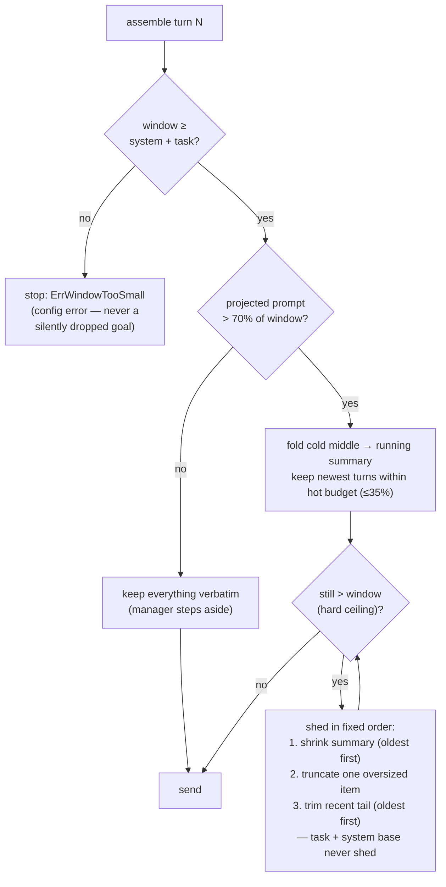

# Working memory

How kloo keeps a small-context model (e.g. an 8k window) on-task while it
auto-traverses a codebase. The short version: **kloo never relies on the model to
"remember." It rebuilds the prompt from scratch every turn to fit the window, and
the traversal output is the first thing it compacts away.**

This is a deterministic, in-process layer (`internal/agent/memory.go`) — no extra
LLM call, so it's byte-for-byte testable and adds no latency. It's on by default;
`maxContextTokens` (default **8000**) is the hard ceiling it packs under.

## Each turn, the prompt is re-assembled — not accumulated

Instead of resending an ever-growing transcript, kloo packs the window with a
fixed structure and re-derives it every step from the live run state:

```mermaid
flowchart LR
    subgraph SRC["live run state"]
        Task["task<br/>(the goal)"]
        Convo["full transcript<br/>(every step so far)"]
        Verify["last verify result"]
        Edit["file under edit"]
        Repo["repo map"]
    end

    SRC --> WM{{"working memory<br/>Assemble()<br/>structural · no LLM call"}}

    WM --> PROMPT

    subgraph PROMPT["assembled prompt ≤ window (e.g. 8k)"]
        direction TB
        P1["system base + repo map<br/><b>≤ 35% of window</b> (capped)"]
        P2["task — <b>pinned, never dropped</b>"]
        P3["verify result + current file<br/><b>pinned</b> (file re-read FRESH from disk)"]
        P4["recent tail (newest turns, verbatim)"]
        P5["running summary (cold middle, folded)"]
    end

    style P2 fill:#1f6feb22,stroke:#1f6feb
    style P3 fill:#1f6feb22,stroke:#1f6feb
```



**Pinned — never dropped:**
- **Task** (`convo[0]`) — the goal. Survives everything.
- **Current file under edit** — re-read **fresh from disk each turn**, not the
  stale copy from when it was first read. Even after heavy compaction, the actual
  current bytes of the file being worked on are always in the prompt. *This is what
  keeps it anchored to "the context it's working on."*
- **Last verify result** — the real signal it's iterating against.

**Kept within budget:**
- **Recent tail** — the newest turns verbatim (latest reasoning + observations).
- **Running summary** — the cold middle (all those `list_dir`/`read_file`
  traversal steps) folded into a few compact lines.

## What happens when it fills up

The traversal is transient by design: browsing 30 files at step 3 doesn't stay
verbatim — it collapses into the summary, freeing the window for the work at hand.



## The window budget (8k example)

```
┌─ maxContextTokens = 8000 ───────────────────────────────────────────────┐
│                                                                          │
│  system base + repo map        ≤ 35%  (~2.8k)  ← map capped so it can't  │
│                                                  "eat the window"        │
│  task (the goal)               pinned · never dropped                    │
│  verify result + current file  pinned · file re-read fresh each turn  ┐  │
│  recent tail (newest turns)    verbatim                               ┘  │
│      └─ pins + tail together   ≤ 35%  (~2.8k)                            │
│  running summary (cold middle) fills the remaining slack                 │
│                                                                          │
│  compaction triggers at 70% projected (~5.6k) ─────────────────────────  │
└──────────────────────────────────────────────────────────────────────────┘
```

Fractions (fixed in `internal/agent/memory.go`): repo map `0.35`, pins+tail
`0.35`, compaction trigger `0.70`. The running summary takes the slack up to the
`1.0 ×` hard ceiling.

**What the repo map walks** (`internal/repomap/walk.go`): your source — never the
noise. It hard-skips dependency trees and build/cache output by name
(`node_modules`, `vendor`, `dist`, `build`, `out`, `target`, `www`, `.angular`,
`.next`, `.nuxt`, `.svelte-kit`, `.cache`, `coverage`, …) and honours `.gitignore`
at **every** level, not just the root — so a project nested in a subdirectory still
has its own ignores respected. This matters right after a build: an Ionic `npm run
build` writes ~1.4k files into `www/` and ~400 into `.angular/`; without skipping
them the map would flood with compiled bundles and balloon the prompt every turn.
Files over 1 MiB are skipped too (no useful symbols, and they'd be read whole) —
all still reachable via `read_file`/`list_dir`.

You can watch compaction happen live: the **`⟲N` counter in the TUI header** is
the cumulative number of compactions this run.

## Keeping a small-context model on-track

Summaries are lossy — at 8k the verbatim budget is genuinely tight, so on a broad
task a small model can still lose a thread that got compacted. The pins (goal +
fresh current-file + verify) are what keep it anchored. To help further:

- **Scope the task** and give ordered steps so it doesn't over-explore.
- **`/add` the files that matter** — pinned files go into the system prompt every
  turn, immune to compaction.
- **Put standing rules in `AGENTS.md`** (or `@import` them) — like `/add`, the
  `AGENTS.md` block lives in the system prompt and is never compacted, so a
  convention doc read once via `read_file` (which *does* get summarized away) stays
  put when imported instead. See
  [configuration.md](configuration.md#project-instructions-agentsmd).
- **Raise `maxContextTokens`** if your model serves more than 8k — compaction only
  kicks in when needed, so a bigger window just means less summarizing.

See [docs/configuration.md](configuration.md) for the `maxContextTokens` knob and
[docs/tui.md](tui.md) for the `⟲` indicator.

## Optional MCP memory hooks

kloo's deterministic in-process working memory remains the core compaction model.
You can optionally supplement it with an MCP memory server:

- before a task run, kloo calls the configured `recallTool` and appends bounded
  recall text to the system prompt;
- after a task run, kloo calls `storeTool` with model, endpoint, verify summary,
  failure code, and touched files;
- failures are non-fatal and redacted.

Configure this with the reserved `memory` profile block and an `mcpServers` entry.
See [mcp.md](mcp.md) for the schema and trust boundary.
